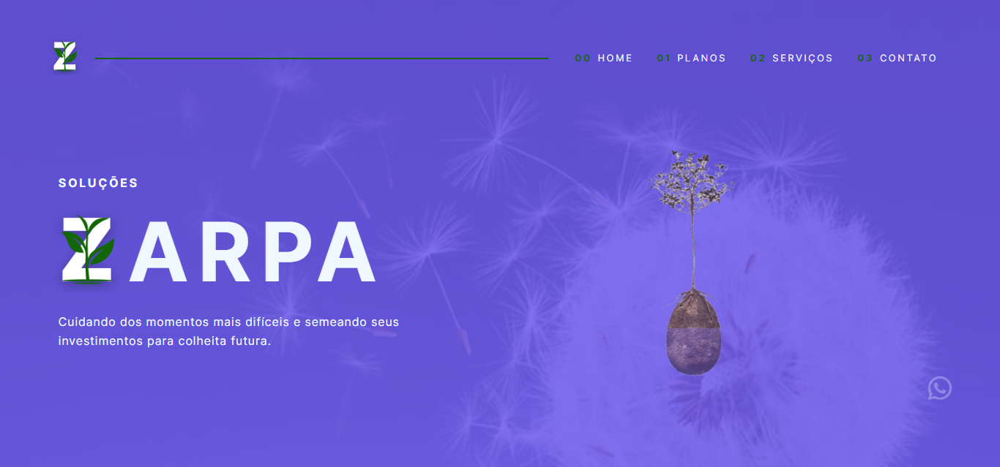

# Projeto da Aula UX/UI - FAP Softex

Este é o resultado do trabalho em grupo proposto durante as aulas de noções de UI/UX no curso de Formação Acelerada em Programação promovido pela Softex PE. 

## Grupo

- Alexandre Lins
- Silas Alexandre

### Screenshot

### Links

- Solution URL: [Repository](https://github.com/aslinsjr/ux-ui-project)
- Live Site URL: [Page](https://ux-ui-project.vercel.app/)

##  Desenvolvido com

- HTML5
- CSS3
- React.js

